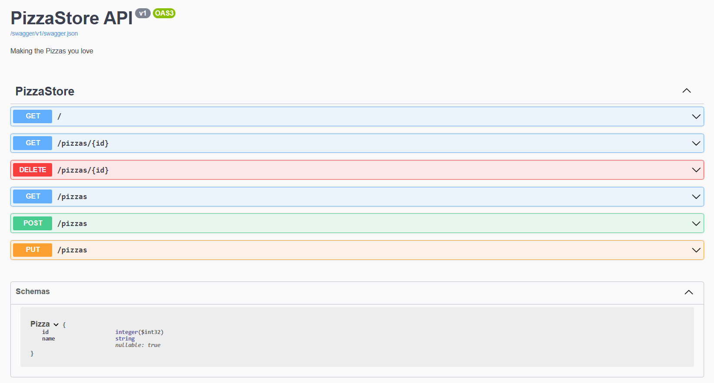

# 🍕 PizzaStore API

Una API simple construida con ASP.NET Core Minimal APIs para manejar una base de datos de pizzas. ¡Ideal para aprender los fundamentos del desarrollo de APIs RESTful!

## 📋 Descripción

PizzaStore es una API básica que permite obtener, crear, actualizar y eliminar pizzas desde una base de datos en memoria. También incluye documentación Swagger para facilitar la exploración de los endpoints disponibles.

---

## 🚀 Tecnologías

- [.NET 6+](https://dotnet.microsoft.com/)
- Minimal APIs
- Swagger / Swashbuckle
- C#

---

## 🛠️ Cómo ejecutar el proyecto

1. Clona el repositorio:
   ```bash
   git clone https://github.com/tuusuario/pizzastore-api.git
   cd pizzastore-api```

2. Restaura los paquetes:
```dotnet restore```
3. Ejecuta la aplicación:
```dotnet run```
4. Abre Swagger UI (modo desarrollo):
```http://localhost:<puerto>/swagger```


📂 Estructura del Proyecto
PizzaStore/
├── Program.cs         # Configuración de la app y rutas
└── DB/
    └── PizzaDB.cs     # Lógica de la "base de datos" en memoria


## Swagger
